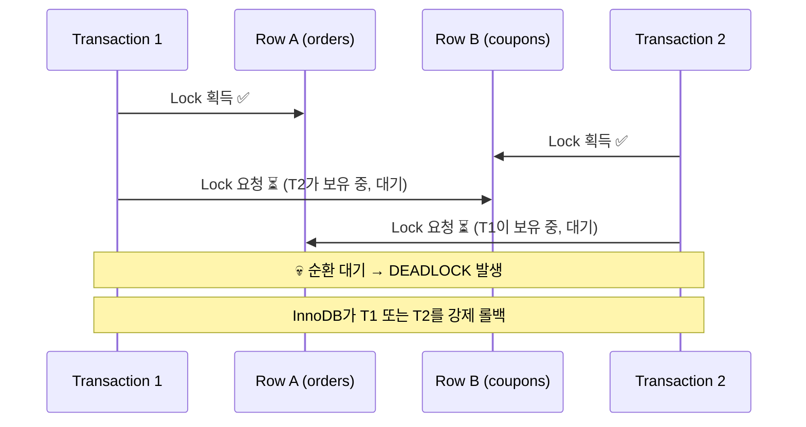

잘못된 게시글 작성 모음
차후 내용 개선에 사용될 데이터 "변경 금지"

$case{number} - start , end 로 구분됨

$case1 start

## 제목 후보

1. **데드락 완전 정복: 원인 분석부터 실무 해결까지 (feat. MySQL/Java)**
2. **백엔드 개발자가 반드시 알아야 할 데드락 진단·예방·복구 완벽 가이드**
3. **데드락이 터졌을 때 당황하지 않는 법: 원인·탐지·예방·재시도 총정리**

---

## 이 글에서 얻을 수 있는 것

- 데드락이 왜 발생하는지 구조적으로 이해하고, 로그만 보고도 원인을 파악할 수 있습니다.
- MySQL과 Java 환경에서 즉시 적용 가능한 데드락 해결 코드와 패턴을 얻어 갑니다.
- 실제 운영 장애 시나리오를 통해 예방 전략과 모니터링 방법을 체계적으로 익힐 수 있습니다.

---

## 데드락이란 무엇인가

데드락(Deadlock)은 두 개 이상의 트랜잭션(또는 스레드)이 **서로 상대방이 점유한 자원을 기다리며 영원히 진행되지 못하는 상태**입니다.

서버 로그에 갑자기 `Deadlock found when trying to get lock` 에러가 터지거나, API 응답이 수십 초째 돌아오지 않는 경험, 한 번쯤 있으시죠? 단순히 "다시 배포하면 낫겠지"로
넘어가면 같은 장애가 반복됩니다. 이 글은 데드락을 구조적으로 이해하고, 진단하고, 예방하는 전 과정을 다룹니다.

[IMAGE: diagram showing two transactions in a circular deadlock waiting for each other's locked resources]

---

## 데드락의 구조: 왜 발생하는가

### Coffman 조건 — 4가지가 동시에 충족될 때 터진다

데드락은 아래 네 가지 조건이 **모두** 성립할 때만 발생합니다. 하나라도 깨면 데드락은 원천 차단됩니다.

| 조건        | 설명                        | 깨는 방법                     |
|-----------|---------------------------|---------------------------|
| **상호 배제** | 한 번에 하나의 트랜잭션만 자원 점유 가능   | 낙관적 락(Optimistic Lock) 사용 |
| **점유 대기** | 자원을 가진 채로 다른 자원을 기다림      | 트랜잭션 범위 최소화               |
| **비선점**   | 다른 트랜잭션의 자원을 강제로 빼앗을 수 없음 | 락 타임아웃 설정                 |
| **순환 대기** | T1→T2→T1 처럼 순환 의존 관계 형성   | **락 획득 순서 통일 (가장 현실적)**   |

실무에서는 **"순환 대기"를 제거하는 것**이 가장 효과적인 예방책입니다. 나머지 세 조건은 DB 특성상 제어가 어렵습니다.

---

### 락 획득 순서 불일치 — 가장 흔한 패턴



**T1은 A → B 순서**로, **T2는 B → A 순서**로 락을 잡으면 발생합니다. 각자 첫 번째 자원은 이미 획득했고, 두 번째 자원은 상대방이 들고 있어 영원히 기다리는 구조가 됩니다.

---

### MySQL InnoDB의 락 종류 이해

데드락을 제대로 분석하려면 InnoDB가 어떤 락을 쓰는지 알아야 합니다.

| 락 종류                   | 설명                                                | 충돌 여부                |
|------------------------|---------------------------------------------------|----------------------|
| **Shared Lock (S)**    | 읽기 락. `SELECT ... FOR SHARE`                      | S끼리는 공존, X와 충돌       |
| **Exclusive Lock (X)** | 쓰기 락. `SELECT ... FOR UPDATE`, `UPDATE`, `DELETE` | S·X 모두와 충돌           |
| **Record Lock**        | 인덱스 레코드 단건 락                                      | -                    |
| **Gap Lock**           | 인덱스 사이 간격 락 (팬텀 방지)                               | REPEATABLE READ에서 작동 |
| **Next-Key Lock**      | Record Lock + Gap Lock 합성                         | InnoDB 기본 동작         |

> 💡 팁: `READ COMMITTED` 격리 수준을 사용하면 Gap Lock이 비활성화되어 데드락 발생 범위가 줄어듭니다. 팬텀 리드가 허용되는 비즈니스라면 격리 수준 조정도 전략 중 하나입니다.

---

## 데드락 탐지와 로그 분석

### SHOW ENGINE INNODB STATUS로 현황 파악

```sql
-- 가장 최근 데드락 정보 조회 (MySQL)
SHOW
ENGINE INNODB STATUS
\G
```

`LATEST DETECTED DEADLOCK` 섹션을 찾으세요. 어떤 트랜잭션이 어떤 인덱스/row에 락을 걸고 충돌했는지 상세히 나옵니다.

```
------------------------
LATEST DETECTED DEADLOCK
------------------------
2024-11-15 14:02:31 0x7f3a2c00

*** (1) TRANSACTION:
TRANSACTION 421, ACTIVE 2 sec starting index read
LOCK WAIT 2 lock struct(s), heap size 1136, 1 row lock(s)
MySQL thread id 10, query id 100 updating

UPDATE orders SET status = 'PAID' WHERE id = 1
-- 👆 T1이 orders.id=1 에 X Lock 요청 중 (대기)

*** (1) WAITING FOR THIS LOCK TO BE GRANTED:
RECORD LOCKS space id 58 page no 3 n bits 72
index PRIMARY of table `shop`.`orders`
-- 👆 orders 테이블 PK 인덱스의 Record Lock 대기

*** (2) TRANSACTION:
TRANSACTION 422, ACTIVE 3 sec starting index read
UPDATE coupons SET used = 1 WHERE order_id = 1
-- 👆 T2가 coupons 행을 들고 orders 행 대기 중

*** WE ROLL BACK TRANSACTION (1)
-- 👆 InnoDB가 T1을 희생자(victim)로 선택해 롤백
```

**로그 읽는 순서:**

1. TRANSACTION (1), (2) 각각의 `query` 확인 → 어떤 SQL이 충돌했는지
2. `WAITING FOR THIS LOCK` 확인 → 어떤 테이블/인덱스/row가 문제인지
3. `WE ROLL BACK TRANSACTION` 확인 → 누가 희생자인지

---

### 실시간 락 대기 모니터링

```sql visualize mysql deadlock
-- MySQL 5.7+ 실시간 락 대기 현황
SELECT r.trx_id                                         AS waiting_trx_id,
       r.trx_mysql_thread_id                            AS waiting_thread,
       r.trx_query                                      AS waiting_query,
       b.trx_id                                         AS blocking_trx_id,
       b.trx_mysql_thread_id                            AS blocking_thread,
       b.trx_query                                      AS blocking_query,
       TIMESTAMPDIFF(SECOND, r.trx_wait_started, NOW()) AS wait_seconds
FROM information_schema.innodb_lock_waits w
         JOIN information_schema.innodb_trx b ON b.trx_id = w.blocking_trx_id
         JOIN information_schema.innodb_trx r ON r.trx_id = w.requesting_trx_id
ORDER BY wait_seconds DESC;
```

위 쿼리는 현재 락 대기 중인 모든 트랜잭션을 실시간으로 보여줍니다. `wait_seconds`가 높은 항목부터 확인하면 가장 심각한 병목을 빠르게 찾을 수 있습니다.

---

### 데드락 이력 자동 기록 설정

```sql
-- my.cnf 또는 SET GLOBAL로 설정
-- 데드락 발생 시 에러 로그에 자동 기록
SET
GLOBAL innodb_print_all_deadlocks = ON;

-- 락 대기 최대 시간 (기본값 50초 → 실무에서는 3~5초 권장)
SET
GLOBAL innodb_lock_wait_timeout = 5;
```

`innodb_print_all_deadlocks = ON`으로 설정하면 `SHOW ENGINE INNODB STATUS`가 아닌 **MySQL 에러 로그 파일**에 데드락이 발생할 때마다 자동 기록됩니다. 운영
환경에서 필수 설정입니다.

---

## 해결 방법

### 해결 1: 락 획득 순서 통일

**❌ 잘못된 예시 — 코드 경로마다 락 획득 순서가 다름**

```java
// 의존성: Spring @Transactional, Spring Data JPA

// T1 코드 경로: orders → coupons 순서로 락
@Transactional
public void processPayment(Long orderId, Long couponId) {
    Order order = orderRepository.findByIdWithLock(orderId);   // Lock A (orders)
    Coupon coupon = couponRepository.findByIdWithLock(couponId); // Lock B (coupons)
    order.pay();
    coupon.markUsed();
}

// T2 코드 경로: coupons → orders 순서로 락 (역순!) → 데드락 유발
@Transactional
public void cancelWithCouponRefund(Long couponId, Long orderId) {
    Coupon coupon = couponRepository.findByIdWithLock(couponId); // Lock B (coupons)
    Order order = orderRepository.findByIdWithLock(orderId);    // Lock A (orders)
    coupon.restore();
    order.cancel();
}
```

**✅ 개선된 예시 — 모든 코드 경로에서 항상 동일한 순서로 락 획득**

```java
// 의존성: Spring @Transactional, Spring Data JPA
// 규칙: 항상 orders → coupons 순서로 락 획득 (팀 전체 컨벤션으로 문서화)

@Transactional
public void processPayment(Long orderId, Long couponId) {
    // ✅ 항상 orders 먼저, coupons 나중
    Order order = orderRepository.findByIdWithLock(orderId);
    Coupon coupon = couponRepository.findByIdWithLock(couponId);
    order.pay();
    coupon.markUsed();
}

@Transactional
public void cancelWithCouponRefund(Long orderId, Long couponId) {
    // ✅ 동일한 순서 유지 — 순환 대기 원천 차단
    Order order = orderRepository.findByIdWithLock(orderId);
    Coupon coupon = couponRepository.findByIdWithLock(couponId);
    order.cancel();
    coupon.restore();
}
```

**같은 테이블에서 여러 row를 동시에 락 걸어야 할 때**

```java
// ❌ 순서 보장 없음 → 데드락 위험
List<Long> ids = List.of(5L, 3L, 1L); // 임의 순서
List<Order> orders = orderRepository.findAllByIdWithLock(ids);

// ✅ PK 오름차순 정렬 후 처리 → 순환 대기 방지
List<Long> ids = List.of(5L, 3L, 1L);
List<Long> sortedIds = ids.stream().sorted().collect(Collectors.toList());
List<Order> orders = orderRepository.findAllByIdInOrderById(sortedIds);
// JPA 쿼리: SELECT ... WHERE id IN (:ids) ORDER BY id ASC FOR UPDATE
```

> 💡 팁: 동일 테이블에서 여러 row를 락 걸어야 한다면 **반드시 PK 오름차순으로 정렬한 뒤 순차 처리**하세요. `WHERE id IN (5, 3, 1)`처럼 순서가 보장되지 않으면 실행 계획에 따라 락
> 순서가 달라질 수 있습니다.

---

### 해결 2: 트랜잭션 범위 최소화

Lock 보유 시간이 길수록 다른 트랜잭션과 충돌할 확률이 높아집니다. **Lock 보유 시간 = 데드락 확률**이라고 이해하면 됩니다.

**❌ 잘못된 예시 — 트랜잭션 안에서 외부 I/O 수행**

```java
// 의존성: Spring @Transactional, JPA, ExternalPaymentApi

@Transactional
public void payOrder(Long orderId) {
    
$case1 end
// @Transactional public void payOrder(Long orderId) {  에서 끈긴이유 는?