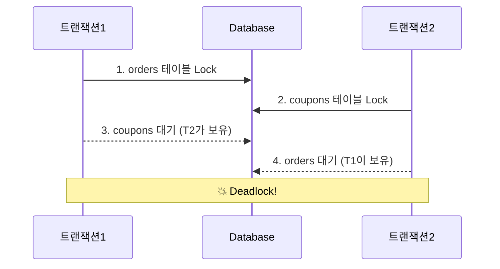
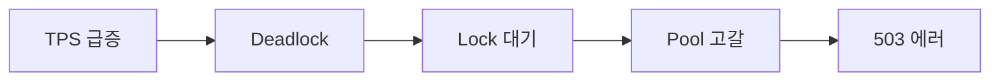

# AI Blog Automation — 프로젝트 계획서

> 작성일: 2026-03-20 / 최종 수정: 2026-03-26 (SSE 스트리밍 전체 파이프라인 버그 해결 — ObjectMapper, done race condition, bodyToFlux data 접두사,
> 실시간 pre 렌더링)

/*

# 발행하기전  게시글 우측에는 ai 평가가 나왔으면 좋겠어

* 이건 hashnode 블로그 까지 전달 되는게 아님

1) 다양한 ai 모델을 선택해서 측정 하기
2) 평가후 "추가 요청사항" 에 들어갈 내용 받기
3) 받은 요청사항으로 AI 개선 다시받기

UI

1) 우측에 ui 고정되어 보여줘야해


* 차후 db안에는 200~300 자 이내의 프롬포트를 각자 가지며 자가성장? 비슷하게 가능하게 만들 계획이라(개발x, 구상만)

# hashnode 게시글 내 태그 연동 안됨

연동이 되지않았어 문제 해결 방안과 테스트 해
---

[Claude 피드백]

## AI 평가 패널 메모에 대해

제안한 흐름 (모델 선택 → 평가 → 추가 요청사항 생성 → 재개선)은 기존 AI 개선 기능과 잘 연결된다.

구현 관점에서 고려할 점:

1. **평가 결과 저장 구조**
    - 평가는 발행 전 확인용이므로 Hashnode에 전달하지 않음 — DB에는 저장 여부 결정 필요
    - 저장한다면 `AiEvaluation` 테이블 분리 (postId, model, evalContent, createdAt)
    - 저장 안 한다면 SSE 스트리밍으로 프론트에만 전달하고 완료 후 버림 → 더 단순

2. **"추가 요청사항" 자동 생성 흐름**
    - AI 평가 결과에서 "가장 치명적인 문제 TOP 3"를 extraPrompt로 자동 채워주는 방식이 핵심 UX
    - 평가 완료 후 "이 내용으로 AI 개선 요청" 버튼 → `AiSuggestionPanel`의 extraPrompt에 자동 주입

3. **기존 구조 재활용 범위**
    - 평가 전용 엔드포인트 `POST /api/ai-suggestions/{postId}/evaluate` 추가 방식 권장
    - `PromptBuilder`에 `buildEvaluation()` 메서드 분리 — 개선 프롬프트와 평가 프롬프트는 목적이 다름
    - SSE 스트리밍은 기존 인프라 그대로 재사용 가능

4. **자가성장 구상에 대해**
    - 각 프롬프트가 200~300자 자체 설명(메타 프롬프트)을 가지는 구조는 RAG 없이 경량으로 구현 가능
    - 지금은 구상 단계이므로 `Prompt` 엔티티에 `metaPrompt TEXT` 컬럼 하나 예약해두는 정도로 충분
    - 실제 자가학습(피드백 반영 자동 업데이트)은 별도 배치 또는 수동 큐레이션 방식이 안전함
    - **구체화**: 기본 default 프롬프트가 있고, 자가성장 시 "해당 글의 평가 결과 → 프롬프트 개선" 흐름
      → 평가 API 완성 후 "이 평가로 프롬프트 개선" 버튼 추가 가능

5. **UI — 우측 고정 패널**
    - `position: sticky` + `top` 값으로 스크롤 시에도 화면에 고정
    - `PostDetailPage` 레이아웃을 2컬럼(본문 + 우측 사이드바)으로 변경 필요
    - 현재 `AiSuggestionPanel`도 사이드바 영역으로 이동 고려

## Hashnode 태그 연동 안 됨에 대해

**원인**: `HashnodeGraphqlBuilder.buildTagsNode()`에서 로컬 태그 문자열로 slug를 임의 생성하는데,
Hashnode API는 **자체 DB에 등록된 태그의 slug와 정확히 일치**해야만 연동됨. 임의 생성 slug는 무시됨.

**해결 방안 3가지:**

1. **방안 A — Hashnode 태그 검색 API** (정확, 추가 API 호출 필요)
   - 발행 전 `searchTags` GraphQL로 실제 slug 조회 → 매칭된 것만 전송
   - API 호출 추가 + 복잡도 증가

2. **방안 B — 태그 빈 배열 전송** (단순, 태그 없음)
   - `tags: []` 로 전송, 발행 후 사용자가 Hashnode에서 직접 추가
   - 현재 동작과 실질적으로 동일 (태그가 무시되므로)

3. **방안 C — 사용자 태그 ID 사전 등록** (권장)
   - ProfilePage에서 자주 쓰는 Hashnode 태그 ID를 미리 등록
   - 발행 시 로컬 태그명 → 등록된 Hashnode tag ID 매핑

**단기 대응**: 방안 B (빈 배열, 현재 동작 유지 + 이슈 인지)
**장기 대응**: 방안 C

## 제목 생성 메모에 대해

제안한 방향("~의(는) ~다" 형식, 후보 나열 금지, 직접 제목 결정)은 구현 관점에서 명확하다.

다만 구현 시 고려할 점:

1. **제목 교체 타이밍 문제**
    - 현재 `suggestedContent`에 본문만 있음. 제목을 바꾸려면 AI 응답 파싱 구조 변경 필요
    - 예: 첫 줄이 `# 제목` 형식이면 분리 추출, 아니면 별도 `suggestedTitle` 필드 추가
    - `accept` 액션 시 `Post.title`도 함께 업데이트해야 하는데 현재 accept는 `content`만 반영함

2. **제목 품질 안정성**
    - "~의(는) ~다" 형식을 프롬프트로 강제하면 AI가 그 패턴에 끼워 맞추는 부자연스러운 제목이 나올 수 있음
    - 후보를 내지 말고 하나만 결정하라는 지시도 AI가 잘 따르지 않는 모델이 있음 (특히 GPT-4o)
    - 검증 로직 추가 고려: 제목에 "후보" "다음 중" 같은 단어가 들어오면 다시 요청하거나 파싱 필터링

3. **기존 제목 vs AI 제안 제목 충돌**
    - 사용자가 직접 지은 제목을 덮어쓰는 것은 민감한 UX 결정
    - "제목도 바꿀지 선택" 옵션 UI를 두는 게 더 안전할 수 있음

---

## 블로그 평가 기준 6개에 대해

기준 자체는 잘 설계되어 있다. 실무 블로그 품질 평가에 적합한 항목들.

보완하면 좋을 점:

1. **점수 인플레이션 문제**
    - AI에게 "10점 만점" 점수를 주게 하면 대부분 6-8점대에 몰리는 경향이 있음
    - 상대 비교("동일 주제 블로그 상위 10%와 비교하면 몇 점인가?") 형식이 더 날카로운 피드백을 유도함

2. **평가 기준 간 상관관계**
    - `Depth`와 `Evidence`는 높게 받기 어렵지 않지만 `Originality`는 AI가 낮게 주기 어려운 항목
    - AI 입장에서 "이 글만의 경험 기반 인사이트"를 판단하는 게 실제로 어렵기 때문
    - 오히려 "구글 검색 1페이지 글과 문장 유사도가 높은가?" 같은 검증 가능한 지시가 낫다

3. **ContentType별 가중치**
    - `ALGORITHM` 글에는 `Evidence` (벤치마크, 복잡도)가 중요하고
    - `CS` 이론 글에는 `Depth`가 더 중요함
    - 동일한 기준을 모든 ContentType에 적용하면 `CS` 글이 `Evidence` 점수에서 불이익을 받을 수 있음

---

## 4단계 글쓰기 프롬프트 파이프라인에 대해

설계 자체는 탄탄하다. "설계 → 작성 → 리뷰 → 압축" 흐름은 실제로 고품질 기술 글쓰기에서 효과적인 방법론.

AI 연동 시 고려할 점:

1. **단계별 컨텍스트 전달이 핵심**
    - 4단계가 각각 별도 AI 호출이 되려면 1단계 결과를 2단계에 넘기는 구조가 필요
    - 현재 시스템은 단일 `extraPrompt` + `content` 구조라 4단계 파이프라인을 직접 자동화하려면 설계 변경 필요
    - 단기적으로는 "1-4단계 합친 단일 프롬프트"로 구현하고, 장기적으로 멀티턴 대화 구조로 확장 고려

2. **3단계 리뷰가 핵심**
    - 위에서 정의한 평가 기준 6개 + 필수 피드백 5개는 3단계 리뷰 프롬프트 그 자체
    - AI 개선 요청 시 이 평가를 먼저 수행하고, 그 결과를 기반으로 글을 재작성하게 하는 것이 핵심 가치
    - 즉, 현재 `PromptBuilder`에 3단계 리뷰 로직을 통합하는 것이 가장 임팩트 있는 구현 방향
    - **예외 조건**: `content` 길이 30자 미만인 경우 (예: "데드락"처럼 짧은 요청)
      → 게시글 개선이 아닌 "설명해줘" 의도에 가깝기 때문에 평가 기준 + 4단계 파이프라인 적용 불필요
      → 이 경우 기존 단순 개선 프롬프트만 사용

3. **압축 단계 주의**
    - "20~30% 줄이되 정보량 유지" 지시는 AI가 잘 수행하지만, 기술 글에서 코드 블록이나 수치를 삭제하는 경우가 있음
    - 압축 프롬프트에 "코드 블록, 벤치마크 수치, Before/After 표는 절대 삭제 금지" 명시 필요

*/

## 문서 구조

| 파일                                         | 역할                               |
|--------------------------------------------|----------------------------------|
| [`backend/claude.md`](backend/claude.md)   | 백엔드 코드 레벨 상세 (API, 도메인, 이슈 기록)   |
| [`frontend/CLAUDE.md`](frontend/CLAUDE.md) | 프론트엔드 코드 레벨 상세 (컴포넌트, 타입, 이슈 기록) |
| [`sqlviz.md`](sqlviz.md)                   | SQLViz 설계 / UX / AI 연동 가이드       |
| [`infra.md`](infra.md)                     | 배포 / 인프라 셋업 절차                   |
| [`monitoring.md`](monitoring.md)           | 운영 / 장애 대응                       |
| [`research.md`](research.md)               | 리서치 내용                           |

---

## Mermaid 다이어그램 사용 기준

> **역할**: 복잡한 시스템 장애 흐름을 가독성 높고 직관적인 다이어그램으로 재구성한다.
> **핵심**: 내용에 따라 타입을 구분해서 사용한다. `flowchart TD` 단독 나열은 금지.

---

### 타입 선택 기준

| 상황                                                  | 사용 타입                       |
|-----------------------------------------------------|-----------------------------|
| 트랜잭션 간 상호작용, 시간 순서, Lock 획득/대기 상태 전이, 여러 주체 간 통신 흐름 | `sequenceDiagram`           |
| 단순 인과관계, 한 방향 원인→결과 체인, 프로세스 단계 나열                  | `flowchart LR`              |
| 노드 6개 이상이고 단계 그룹화가 의미 있을 때                          | `flowchart LR` + `subgraph` |

---

### 1. sequenceDiagram — 주체 간 상호작용

트랜잭션이 DB와 어떤 순서로 Lock을 주고받는지처럼 **시간축 + 교차 흐름**이 핵심일 때 사용.
`flowchart`로는 "T1이 T2의 Lock을 기다린다"는 교차 관계를 표현하기 어렵다.



---

### 2. flowchart LR — 단순 인과 체인

"A가 일어나서 B가 되고 C가 된다"처럼 **한 방향 흐름**이 전부일 때 사용.
5단계 이하 단순 체인에는 `subgraph` 없이도 충분하다.



단계가 복잡하거나(6개 이상) 구간별 의미 구분이 필요한 경우에만 `subgraph` 추가:

```mermaid
flowchart LR
    subgraph 트리거
        A[TPS 50→300]
    end
    subgraph 락 충돌
        B[동시 결제] --> C[Deadlock 200건/h]
    end
    subgraph 리소스 고갈
        D[Lock 대기 50초] --> E[Connection 점유] --> F[HikariCP 포화]
    end
    subgraph 결과
        G[503 전체 실패]
    end
    트리거 --> 락 충돌 --> 리소스 고갈 --> 결과
```

---

### 공통 규칙

- 다이어그램 위에 **한 줄 핵심 요약** 항상 선행
- 노드 텍스트는 명사형 키워드 위주, 한 박스에 한 개 의미
- "읽는 다이어그램"이 아닌 "보는 다이어그램" — 주니어가 5초 안에 이해 가능한 수준

---

## 1. 프로젝트 개요

GitHub 활동(커밋, PR, README 등)을 자동 수집해 Claude / Grok / GPT / Gemini AI로 블로그 글을 개선하고 Hashnode에 발행하는 자동화 시스템.

두 가지 흐름: **GitHub 레포 → 수집 → 초안 → AI 개선 → 발행** / **직접 작성 → AI 개선 → 발행**

---

## 2. 기술 스택

| 영역    | 기술                                                     |
|-------|--------------------------------------------------------|
| 백엔드   | Spring Boot 4.0.3, Java 25, Gradle 9.3.1               |
| 프론트   | React 18 + TypeScript + Vite 5                         |
| DB    | H2 (local) / Docker PostgreSQL (dev) / Supabase (prod) |
| 캐시    | Redis (AI 사용량, Rate Limit, JWT blacklist)              |
| 암호화   | Jasypt `PBEWithMD5AndDES` + AES-256-GCM (DB 컬럼)        |
| 인증    | GitHub OAuth2 + JWT (Access 24h / Refresh 30일)         |
| 컨테이너  | Docker Compose (backend, frontend, redis, certbot)     |
| CI/CD | GitHub Actions → OCI 서버 롤링 배포                          |
| 인프라   | OCI 단일 서버 (2CPU/16GB), 도메인: `git-ai-blog.kr`           |

---

## 3. 구현 현황

### 환경별 설정

- [x] local — H2, `JASYPT_ENCRYPTOR_PASSWORD` 없이 기동
- [x] dev — `./gradlew serverRun` (Redis + PostgreSQL Docker 자동 기동)
- [x] GitHub Actions — local 프로파일, Redis 제외
- [x] mock 로그인 — `@Profile({"local","dev"})`, prod 빌드에서 자동 제거
- [x] Hashnode 발행 — prod 프로파일에서만 실제 발행 허용

### 인프라 / 배포

> 상세 → [`infra.md`](infra.md)

- [x] CI 스마트 재빌드 정책 (`check-prev-result` job)
- [x] backend Dockerfile 레이어 캐시 최적화
- [x] PostgreSQL prepared statement 충돌 해결 (`prepareThreshold: 0`)

### 기능

- [x] AI 사용량 제한 — 전체 + 모델별 일일 한도, Redis 기반, 초과 시 429
- [x] AI 모델 선택 — Claude/Grok/GPT/Gemini 수동 또는 ContentType 자동 라우팅
- [x] 커스텀 프롬프트 — 사용자당 최대 30개, 공개/비공개, 인기순 탐색 (제목 100자 / 내용 2000자 제한)
- [x] 기본 프롬프트 교체 — SEO 최적화 가이드 (`PromptBuilder`)
- [x] API 키 연동 검증 — 저장 시 실제 API 호출로 유효성 확인
- [x] 이미지 생성 — AI 개선 플로우에서 분리, `ImageGenButton` 수동 전용
- [x] GFM + Mermaid 렌더링 (`MarkdownRenderer` + `MermaidBlock`)
- [x] Swagger UI (`/swagger-ui/index.html`)
- [x] Claude `max_tokens` 4096 → 16000 상향 — 긴 글 중간 잘림 방지
- [x] `Page<T>` 직렬화 경고 제거 — `PostPageResponse` DTO 도입
- [x] AI 요청 연결 끊김 해결 — `@Async` + 202 Accepted + 3s 폴링 (방안 A)
- [x] AI SSE 스트리밍 — 토큰 단위 실시간 렌더링, `POST /api/ai-suggestions/{postId}/stream` (방안 B)
- [x] `durationMs` 컬럼 — AI 응답 소요 시간 저장, 모델별 평균 조회
- [x] nginx SSE 지원 — `/api/ai-suggestions/*/stream` 경로에 `proxy_buffering off`
- [x] SSE 버그 수정 — `이미 AI 제안 상태` 오류, `Access Denied` + response committed 오류, 에러 이벤트 미처리
- [x] nginx `Authorization` 헤더 누락 수정 — SSE location에 `proxy_set_header` 지정 시 기본 헤더 상속 끊김 → JWT 인증 실패 → `Access Denied`
  prod 버그 해결
- [x] `SecurityConfig.dispatcherTypeMatchers(ASYNC).permitAll()` — Tomcat async dispatch 시 Security Filter Chain 전체 인가
  체크 제외 → `Access Denied` 근본 원인 해결
- [x] AI 클라이언트 `ObjectMapper` `com.fasterxml` → `tools.jackson` 교체 — Spring Boot 4 Jackson 3.x 환경에서 파싱 실패로 토큰 0개 문제 해결
- [x] SSE `done` race condition 해결 — `concatWith(done)` 방식에서 `Flux.defer(saveResult → __done__)` 방식으로 변경, DB 저장 완료 후
  프론트에 done 전달
- [x] `bodyToFlux(String.class)` `data:` 접두사 자동 제거 대응 — Claude/Grok/GPT/Gemini 파싱 수정
- [x] 스트리밍 중 실시간 텍스트 `<pre>` 렌더링 — 불완전 마크다운 파싱 오류 방지, 완료 후 `MarkdownRenderer` 전환
- [x] AI SSE 예상 완료 시간 표시 — `estimated` 첫 이벤트로 전달, 프론트 카운트다운 UI
- [x] `@Async` SecurityContext 전파 — `DelegatingSecurityContextAsyncTaskExecutor` 래핑,
  `WebMvcConfigurer.configureAsyncSupport` 등록
- [x] AI 개선 시 제목 생성 — `suggestedTitle` 분리, "~의(는) ~다" 형식, 후보 나열 금지, `accept` 시 `Post.title` 함께 교체
- [x] `PromptBuilder` 평가 기준 통합 — 6가지 평가 기준(Structure/Practicality/Depth/Evidence/Readability/Originality) + 필수 피드백 5개를
  리뷰 단계로 적용 (content 30자 미만 예외)
- [x] `PromptBuilder` 4단계 파이프라인 통합 — 설계→작성→리뷰→압축을 단일 프롬프트로 통합, 압축 시 코드블록·수치 삭제 금지 명시
- [x] AI 평가 패널 — 발행 전 우측 `sticky` 고정 패널, 모델 선택 → 6가지 기준 평가 → 추가 요청사항 자동 생성 → AI 개선 재요청 (Hashnode 전달 X)
- [x] PostDetailPage 2컬럼 레이아웃 — 본문 + 우측 사이드바 (`AiSuggestionPanel`, `AiEvaluationPanel` 이동)
- [x] Hashnode 태그 연동 — 단기 대응: 빈 배열 전송 (임의 slug 생성 제거), 장기: 사용자 태그 ID 사전 등록 방식
- [ ] REST Docs — Spring Boot 4 호환 라이브러리 출시 후 구현 예정

### SQL Visualization Widget

> 상세 → [`sqlviz.md`](sqlviz.md)

- [x] 백엔드: `POST/GET/DELETE /api/sqlviz`, `GET /api/embed/sqlviz/{id}` (공개)
- [x] 시뮬레이션 엔진 — 6개 시나리오, 격리 수준 분기, JSQLParser + RowKey + VirtualDB
- [x] 프론트: `SqlVizPage`, `SqlVizEmbedPage`, `ConcurrencyTimeline`, `ExecutionFlow`, `EmbedGenerator`
- [x] PromptBuilder SQLViz 마커 지시문 추가 (ContentType별 추천 포함)
- [x] `sql visualize` 마커 렌더링 — `MarkdownRenderer` 전처리 + `SqlVizMarker` 컴포넌트
- [x] `[IMAGE: ...]` 플레이스홀더 처리 — 이미지 없으면 본문에서 제거
- [x] AI 작성 메타 정보 통합 표시 — PostDetailPage 하단 카드 (모델·날짜·개선횟수), 본문 인용 줄 제거

### 운영 / 모니터링

- [x] 모니터링 가이드 문서 작성 (`monitoring.md`)

### 테스트

- [x] Controller 테스트 (`PostControllerTest`, `MemberControllerTest`)
- [x] Repository 통합 테스트 (4개 — H2 기반)
- [x] 도메인 단위 테스트 (`PostDomainTest`, `MemberDomainTest`, `WebhookSignatureVerifierTest`)
- [x] UseCase 단위 테스트 (`CreatePostUseCaseTest`, `ImportHashnodePostUseCaseTest`, `AiClientRouterTest`)
- [x] SSE 스트리밍 통합 테스트 — `MockAiClient` + `StepVerifier` / `MockMvc` SSE 이벤트 순서 검증 (단위 4개 + Controller 4개 + DB 저장 3개)

---

## 4. 개발 규칙

- 발견한 내용(버그, 설계 결정)은 해당 도메인 `claude.md`에 기록
- Jasypt 암호화는 AI가 직접 수행하지 않음 — jasypt online tool에서 수동 암호화 후 yml에 붙여넣기
- `any` / `unknown` 타입 사용 금지 (프론트엔드)
- 작업 완료 시 해당 문서의 체크박스 완료 표시
