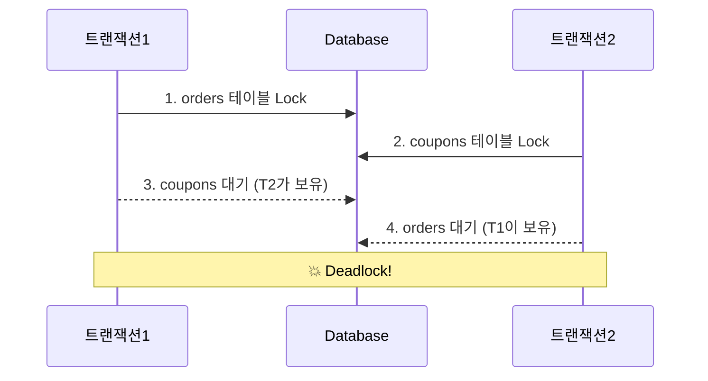
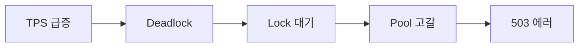

# AI Blog Automation — 프로젝트 계획서

> 작성일: 2026-03-20 / 최종 수정: 2026-03-25 (Mermaid 다이어그램 개선 가이드 추가)
> 개발자: 1인 개인 프로젝트 / 목표 사용자: 최대 100명

<!--
## AI 개선 요청 — 클라이언트 연결 끊김 문제

### 현상
- AI API 호출은 수십 초 소요 → 클라이언트가 타임아웃 또는 네트워크 단절로 먼저 연결을 끊음
- 서버 측에서는 "클라이언트가 연결을 먼저 끊었습니다(Broken pipe / Connection reset)" 에러 발생
- 하지만 AI 응답은 정상 완료되어 DB에 AiSuggestion이 저장됨
- 클라이언트는 에러 화면 표시 → 사용자가 다시 요청 → AI 사용량 이중 차감

### 근본 원인
현재 `POST /api/ai-suggestions/{postId}` 가 동기(sync) 방식:
클라이언트가 AI 응답이 올 때까지 HTTP 연결을 유지해야 함 (30~60초)
→ 브라우저/프록시 타임아웃(보통 30초), 모바일 네트워크 단절 등으로 끊김

### 개선 아이디어

#### 방안 A — @Async 비동기 + 폴링 (구현 난이도: 낮음) ✅ 단기 추천
1. `POST /api/ai-suggestions/{postId}` 즉시 `202 Accepted` 반환
2. 백엔드는 `@Async`로 AI 처리를 별도 스레드에서 실행, 완료 시 DB 저장
3. 클라이언트는 `GET /api/ai-suggestions/{postId}/latest` 를 3~5초 간격으로 폴링
4. 새 `latestSuggestion` 감지 시 폴링 중단 → 정상 표시

- 장점: 기존 API 구조 최소 변경, 추가 인프라 불필요, 구현 빠름
- 단점: 폴링 주기만큼 지연 표시. 진행률 표시 불가 (스피너만)
- 프론트: `AiSuggestionPanel`에 폴링 로직 + 로딩 UI 추가

#### 방안 B — SSE 스트리밍 (구현 난이도: 높음) — "AI가 타이핑하는 것처럼" 실시간 표시
> Q: 실시간으로 AI가 작업 중인 텍스트도 보여줄 수 있어?

**가능하다.** 이게 SSE(Server-Sent Events) + AI 스트리밍 API 조합이다.

**동작 원리:**
1. AI API(Claude, Grok, GPT, Gemini) 모두 스트리밍 모드 지원 — 토큰이 생성될 때마다 청크 단위로 전송
   - **토큰 비용**: 스트리밍 여부는 요금에 영향 없음. 입출력 토큰 수는 동일.
2. 백엔드에서 AI 스트리밍 응답(`text/event-stream`)을 받아 그대로 클라이언트에 SSE로 중계
3. 클라이언트는 SSE 연결을 유지하면서 토큰이 도착할 때마다 화면에 append

**현재 상태 vs 변경 필요:**
- 현재: `ClaudeClient`, `GrokClient` 등 모두 `bodyToMono(String.class)` — 전체 응답 한 번에 수신
- 변경: `bodyToFlux(String.class)` + `text/event-stream` Accept 헤더로 교체 필요
- 백엔드 컨트롤러: `SseEmitter` 또는 `Flux<ServerSentEvent>` 반환으로 교체
- nginx: `proxy_buffering off` 설정 필요 (SSE가 버퍼링되면 실시간 안 됨)

**동시성 성능 고려 (참고용 — 현재 목표 100명):**
- SSE + Spring WebFlux(`Flux` 반환)는 비동기 논블로킹 → 100명 동시 스트리밍도 스레드 수십 개로 처리 가능
- **실질 병목은 AI API rate limit**: Claude/GPT 등 분당 요청 한도에 먼저 막힘 (서버 CPU/메모리보다 먼저)

| 규모 | 주요 병목 | 추가로 필요한 것 |
|------|----------|----------------|
| 100명 | 없음 | SSE + WebFlux로 충분 |
| 1,000명 | AI API rate limit | Redis Queue + 대기열 UI("N번째 대기 중") |
| 1만명 | 단일 서버 한계 | 수평 확장 + sticky session 또는 Redis Pub/Sub 중계 |
| 100만명 | DB/Redis 자체 | DB 샤딩, Redis Cluster, Kafka, AI API key 다중화 |

**구현 범위:**
- 백엔드: `AiClient` 인터페이스에 `streamComplete()` 메서드 추가, 4개 클라이언트 각각 스트리밍 구현
- 백엔드: `AiSuggestionController`에 SSE 엔드포인트 추가 (`GET /api/ai-suggestions/{postId}/stream`)
- 프론트: `EventSource` API로 SSE 연결, 토큰 도착마다 `MarkdownRenderer`에 누적 렌더링
- 완료 이벤트 수신 시 SSE 닫고 DB 저장된 최종본 `fetchLatest`로 교체

**주의사항:**
- 스트리밍 중 클라이언트가 끊기면 백엔드는 계속 실행 → 완료 후 DB 저장은 정상 (연결 끊김 문제 근본 해결)
- 4개 AI 모두 스트리밍 API 형식이 다름 (Claude: `data:`, GPT: `data:`, Grok: OpenAI 호환, Gemini: 별도 파싱 필요)
- 토큰 카운팅은 스트리밍 완료 후 summary 이벤트에서 추출 (Claude: `message_delta` 이벤트)

**완료 예상 시간 표시 (UX 개선):**
- SSE 스트림 시작 시 첫 이벤트로 "예상 완료까지 약 N초" 전송 → 프론트에서 카운트다운/프로그레스 바
- 구현 방법: `AiSuggestion` 테이블에 `durationMs` 컬럼 추가 → AI 응답 완료 시 소요 시간(ms) 저장
  - 예상 시간 계산: `WHERE model = ? AND durationMs > 0` 조건으로 평균 산출 (0이거나 null이면 자동 제외)
  - 이전 글들은 `durationMs` 미저장 → `durationMs > 0` 조건으로 평균에서 자동 배제
  - 데이터가 없거나 평균 계산 불가 시 → 모델별 하드코딩 fallback (Claude 40초, Grok 20초, GPT-4o 30초)
- 연결이 끊겨도 "처리 중입니다. 잠시 후 확인해보세요." 안내로 재요청 방지 가능

### 결론 / 구현 우선순위
- **단기**: 방안 A — `@Async` + 폴링. 연결 끊김 근본 해결, 구현 빠름
- **중기**: 방안 B — SSE 스트리밍. 방안 A 위에 올리는 구조. AI 타이핑 UX + 예상 시간 표시

-->

## 문서 구조

| 파일                                         | 역할                               |
|--------------------------------------------|----------------------------------|
| [`backend/claude.md`](backend/claude.md)   | 백엔드 코드 레벨 상세 (API, 도메인, 이슈 기록)   |
| [`frontend/CLAUDE.md`](frontend/CLAUDE.md) | 프론트엔드 코드 레벨 상세 (컴포넌트, 타입, 이슈 기록) |
| [`sqlviz.md`](sqlviz.md)                   | SQLViz 설계 / UX / AI 연동 가이드       |
| [`infra.md`](infra.md)                     | 배포 / 인프라 셋업 절차                   |
| [`monitoring.md`](monitoring.md)           | 운영 / 장애 대응                       |
| [`research.md`](research.md)               | 리서치 내용                           |

---

## Mermaid 다이어그램 사용 기준

> **역할**: 복잡한 시스템 장애 흐름을 가독성 높고 직관적인 다이어그램으로 재구성한다.
> **핵심**: 내용에 따라 타입을 구분해서 사용한다. `flowchart TD` 단독 나열은 금지.

---

### 타입 선택 기준

| 상황                                                  | 사용 타입                       |
|-----------------------------------------------------|-----------------------------|
| 트랜잭션 간 상호작용, 시간 순서, Lock 획득/대기 상태 전이, 여러 주체 간 통신 흐름 | `sequenceDiagram`           |
| 단순 인과관계, 한 방향 원인→결과 체인, 프로세스 단계 나열                  | `flowchart LR`              |
| 노드 6개 이상이고 단계 그룹화가 의미 있을 때                          | `flowchart LR` + `subgraph` |

---

### 1. sequenceDiagram — 주체 간 상호작용

트랜잭션이 DB와 어떤 순서로 Lock을 주고받는지처럼 **시간축 + 교차 흐름**이 핵심일 때 사용.
`flowchart`로는 "T1이 T2의 Lock을 기다린다"는 교차 관계를 표현하기 어렵다.



---

### 2. flowchart LR — 단순 인과 체인

"A가 일어나서 B가 되고 C가 된다"처럼 **한 방향 흐름**이 전부일 때 사용.
5단계 이하 단순 체인에는 `subgraph` 없이도 충분하다.



단계가 복잡하거나(6개 이상) 구간별 의미 구분이 필요한 경우에만 `subgraph` 추가:

```mermaid
flowchart LR
    subgraph 트리거
        A[TPS 50→300]
    end
    subgraph 락 충돌
        B[동시 결제] --> C[Deadlock 200건/h]
    end
    subgraph 리소스 고갈
        D[Lock 대기 50초] --> E[Connection 점유] --> F[HikariCP 포화]
    end
    subgraph 결과
        G[503 전체 실패]
    end
    트리거 --> 락 충돌 --> 리소스 고갈 --> 결과
```

---

### 공통 규칙

- 다이어그램 위에 **한 줄 핵심 요약** 항상 선행
- 노드 텍스트는 명사형 키워드 위주, 한 박스에 한 개 의미
- "읽는 다이어그램"이 아닌 "보는 다이어그램" — 주니어가 5초 안에 이해 가능한 수준

---

## 1. 프로젝트 개요

GitHub 활동(커밋, PR, README 등)을 자동 수집해 Claude / Grok / GPT / Gemini AI로 블로그 글을 개선하고 Hashnode에 발행하는 자동화 시스템.

두 가지 흐름: **GitHub 레포 → 수집 → 초안 → AI 개선 → 발행** / **직접 작성 → AI 개선 → 발행**

---

## 2. 기술 스택

| 영역    | 기술                                                     |
|-------|--------------------------------------------------------|
| 백엔드   | Spring Boot 4.0.3, Java 25, Gradle 9.3.1               |
| 프론트   | React 18 + TypeScript + Vite 5                         |
| DB    | H2 (local) / Docker PostgreSQL (dev) / Supabase (prod) |
| 캐시    | Redis (AI 사용량, Rate Limit, JWT blacklist)              |
| 암호화   | Jasypt `PBEWithMD5AndDES` + AES-256-GCM (DB 컬럼)        |
| 인증    | GitHub OAuth2 + JWT (Access 24h / Refresh 30일)         |
| 컨테이너  | Docker Compose (backend, frontend, redis, certbot)     |
| CI/CD | GitHub Actions → OCI 서버 롤링 배포                          |
| 인프라   | OCI 단일 서버 (2CPU/16GB), 도메인: `git-ai-blog.kr`           |

---

## 3. 구현 현황

### 환경별 설정

- [x] local — H2, `JASYPT_ENCRYPTOR_PASSWORD` 없이 기동
- [x] dev — `./gradlew serverRun` (Redis + PostgreSQL Docker 자동 기동)
- [x] GitHub Actions — local 프로파일, Redis 제외
- [x] mock 로그인 — `@Profile({"local","dev"})`, prod 빌드에서 자동 제거
- [x] Hashnode 발행 — prod 프로파일에서만 실제 발행 허용

### 인프라 / 배포

> 상세 → [`infra.md`](infra.md)

- [x] CI 스마트 재빌드 정책 (`check-prev-result` job)
- [x] backend Dockerfile 레이어 캐시 최적화
- [x] PostgreSQL prepared statement 충돌 해결 (`prepareThreshold: 0`)

### 기능

- [x] AI 사용량 제한 — 전체 + 모델별 일일 한도, Redis 기반, 초과 시 429
- [x] AI 모델 선택 — Claude/Grok/GPT/Gemini 수동 또는 ContentType 자동 라우팅
- [x] 커스텀 프롬프트 — 사용자당 최대 30개, 공개/비공개, 인기순 탐색 (제목 100자 / 내용 2000자 제한)
- [x] 기본 프롬프트 교체 — SEO 최적화 가이드 (`PromptBuilder`)
- [x] API 키 연동 검증 — 저장 시 실제 API 호출로 유효성 확인
- [x] 이미지 생성 — AI 개선 플로우에서 분리, `ImageGenButton` 수동 전용
- [x] GFM + Mermaid 렌더링 (`MarkdownRenderer` + `MermaidBlock`)
- [x] Swagger UI (`/swagger-ui/index.html`)
- [x] Claude `max_tokens` 4096 → 16000 상향 — 긴 글 중간 잘림 방지
- [x] `Page<T>` 직렬화 경고 제거 — `PostPageResponse` DTO 도입
- [ ] REST Docs — Spring Boot 4 호환 라이브러리 출시 후 구현 예정

### SQL Visualization Widget

> 상세 → [`sqlviz.md`](sqlviz.md)

- [x] 백엔드: `POST/GET/DELETE /api/sqlviz`, `GET /api/embed/sqlviz/{id}` (공개)
- [x] 시뮬레이션 엔진 — 6개 시나리오, 격리 수준 분기, JSQLParser + RowKey + VirtualDB
- [x] 프론트: `SqlVizPage`, `SqlVizEmbedPage`, `ConcurrencyTimeline`, `ExecutionFlow`, `EmbedGenerator`
- [x] PromptBuilder SQLViz 마커 지시문 추가 (ContentType별 추천 포함)
- [x] `sql visualize` 마커 렌더링 — `MarkdownRenderer` 전처리 + `SqlVizMarker` 컴포넌트
- [x] `[IMAGE: ...]` 플레이스홀더 처리 — 이미지 없으면 본문에서 제거
- [x] AI 작성 메타 정보 통합 표시 — PostDetailPage 하단 카드 (모델·날짜·개선횟수), 본문 인용 줄 제거

### 운영 / 모니터링

- [x] 모니터링 가이드 문서 작성 (`monitoring.md`)

### 테스트

- [x] Controller 테스트 (`PostControllerTest`, `MemberControllerTest`)
- [x] Repository 통합 테스트 (4개 — H2 기반)
- [x] 도메인 단위 테스트 (`PostDomainTest`, `MemberDomainTest`, `WebhookSignatureVerifierTest`)
- [x] UseCase 단위 테스트 (`CreatePostUseCaseTest`, `ImportHashnodePostUseCaseTest`, `AiClientRouterTest`)

---

## 4. 개발 규칙

- 발견한 내용(버그, 설계 결정)은 해당 도메인 `claude.md`에 기록
- Jasypt 암호화는 AI가 직접 수행하지 않음 — jasypt online tool에서 수동 암호화 후 yml에 붙여넣기
- `any` / `unknown` 타입 사용 금지 (프론트엔드)
- 작업 완료 시 해당 문서의 체크박스 완료 표시
